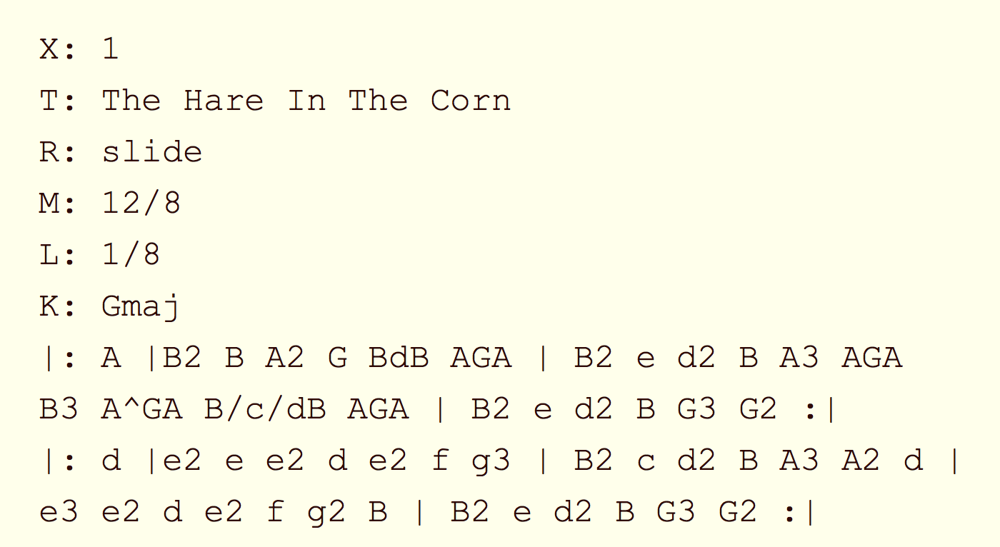
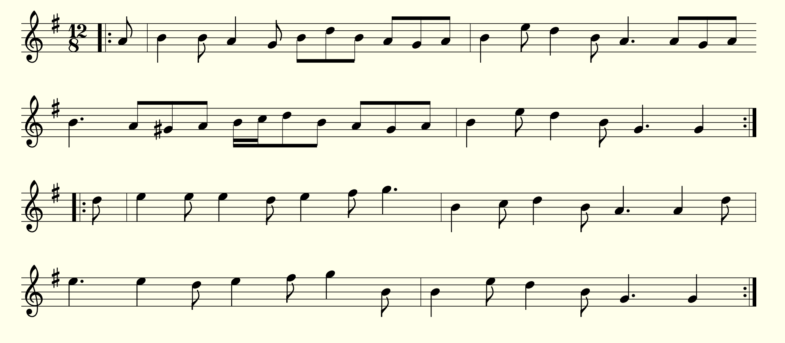
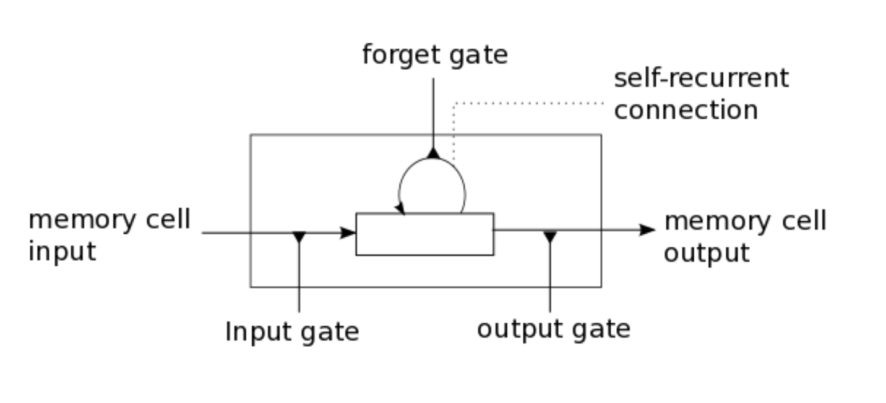
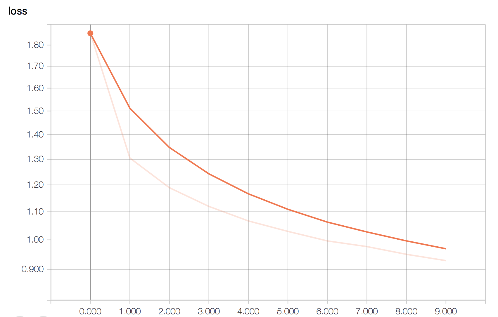
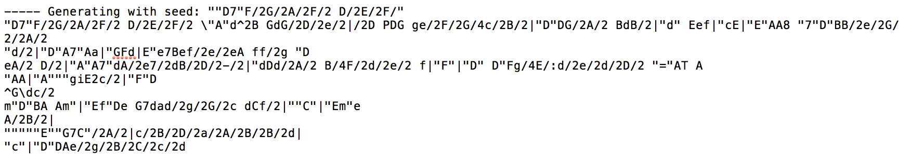
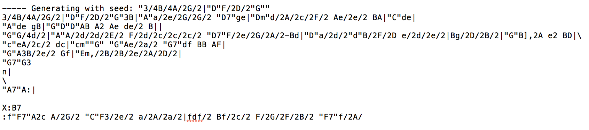
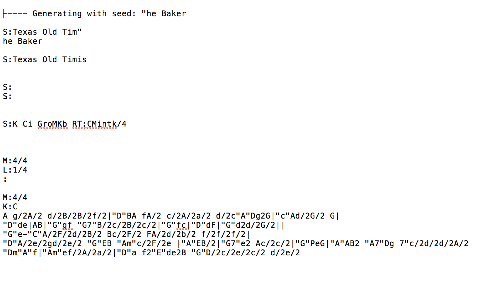
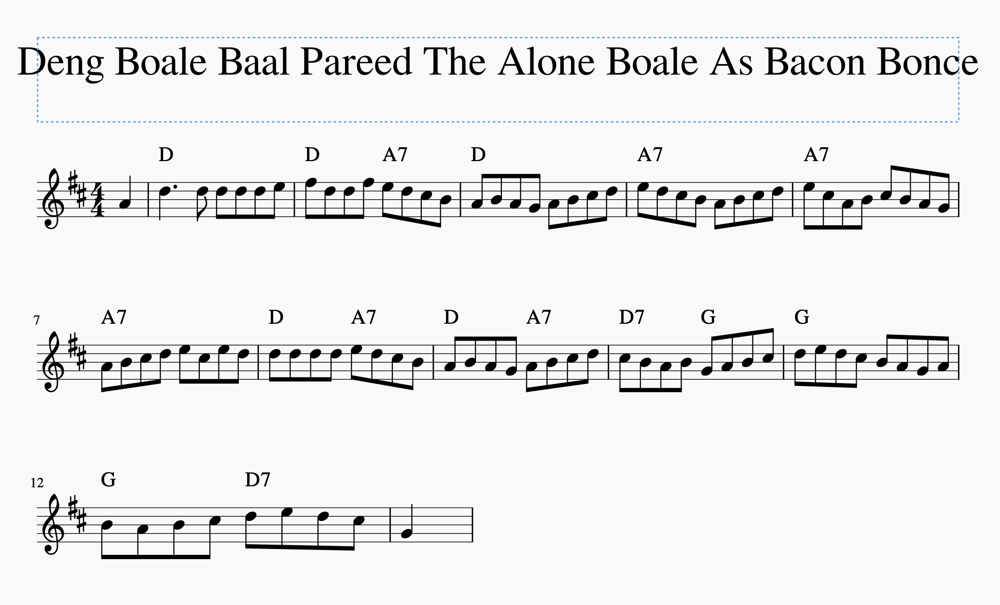

# DJ Neural Net - Artificial Music Composition

##### Intro
The inspiration for this project came from my experience as a classical pianist and my interest in natural language processing and deep learning. When I learned of the power of recurrent neural networks from Andrej Karpathy's paper [The Unreasonable Effectiveness of Recurrent Neural Networks](http://karpathy.github.io/2015/05/21/rnn-effectiveness/), it seemed fitting that I could produce music with such a model.

##### Data
A corpus of traditional Irish folk songs, dances, reels, and jigs contained in the Nottingham Music Database that were translated into ABC format by the [ABC Music Project](http://abc.sourceforge.net/NMD/). I found clean versions of these songs [here](http://abc.sourceforge.net/NMD/). I also trained the network on Bach, Backstreet Boys, Enya and Michael Jackson, also translated into ABC format.

##### About ABC
ABC is a textual representation of music notation. This limited the amount of training data I could use for a model because of its simple format.

 

Though ABC is a rather robust representation of music, there is a bit of nuance lost in translation. It is also somewhat difficult to translate staff notation into ABC format by hand, so I used a program called [EasyABC](https://www.nilsliberg.se/ksp/easyabc/) to do most of the work for me; after EasyABC took care of the translation, I checked the pieces for accuracy.

##### The Model

I am using a [Keras LSTM](https://keras.io/layers/recurrent/#lstm) model with only one LSTM layer that has
1. Memory Units: 100
2. Dropout Rate: 0.3
3. Optimizer: RMSprop, lr=0.01
4. Batch: 100
5. Sequence Length: 25

A LSTM RNN model seemed fitting as context within music is important and must be maintained over long periods of time. The LSTM model better contains this context and thus theoretically would produce better music.

##### Model Performance

Loss over epochs

Evaluating the model was an interesting task as I did not have testing data. Since the goal was to produce new music, there was not a way to properly split the data into testing and training sets. Thus the loss is calculating the difference in predicted and actual values for the entire dataset. With not loss calculated on testing data, the task of evaluation was left to my ears.

##### Results
After 1 epoch:

After 10 epochs:

After 20 epochs:

You can see that the network has learned some of the structure of ABC format, and is even beginning to write titles for its tunes.

##### Postscript
I was able to successfully convert the ABC files to staff notation and play some of the tunes using a program called [MuseScore](https://musescore.org/en). Here are some of my favorite titles:

1. Cone Blcen Cherronatee
2. Slio Keleoso
3. 9D Millillihe Mo's Boy
4. Dewenr Bcend Batlis
5. The Lassie's Fatre
6. The orant sit

And my absolute favorite:

##### References
1. [The Unreasonable Effectiveness of Recurrent Neural Networks](http://karpathy.github.io/2015/05/21/rnn-effectiveness/)
2. [Training a Recurrent Neural Network to Compose Music](https://maraoz.com/2016/02/02/abc-rnn/)
3. [Text Generation With LSTM Recurrent Neural Networks in Python with Keras](https://machinelearningmastery.com/text-generation-lstm-recurrent-neural-networks-python-keras/)
4. [Creating A Text Generator Using Recurrent Neural Network](https://chunml.github.io/ChunML.github.io/project/Creating-Text-Generator-Using-Recurrent-Neural-Network/)
5. [Team Keras](https://github.com/keras-team)
6. [About ABC Notation](http://abcnotation.com/about)

##### In Conclusion
"Never get one of those cheap tin whistles. It leads to much harder drugs like pipes and flutes." -Irish Proverb
