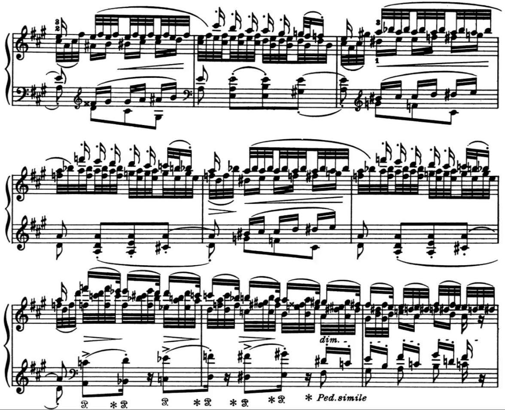
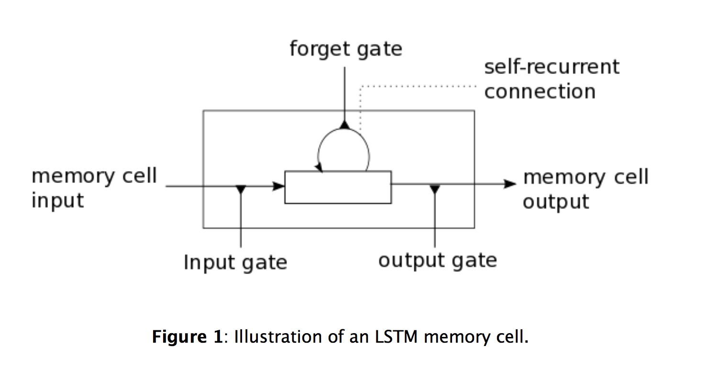

# DJ ABC LSTM
##### Traditional Irish Music with a Modern Twist

##### Goal
The aim of this project is to train a LSTM RNN to write music.

##### Data
A corpus of traditional Irish folk songs, dances, reels, and jigs contained in the Nottingham Music Database that were translated into ABC format by the [ABC Music Project](http://abc.sourceforge.net/NMD/). I found clean versions of these songs [here](http://abc.sourceforge.net/NMD/).
For this particular project, I chose ABC format because it was the simplest form of music notation to use in a neural network.

##### About ABC
ABC is a textual representation of music notation. This limited the amount of training data I could use for a model because of its simple format.

 

You can see that the music is rather simple. This is why my data is limited - there is simply a lot of nuance that cannot be translated into ABC format. For example, imagine how Liszt's Transcendental Etude No. 5 would look in ABC format:

Therefore, for this particular project, my data is limited to simpler melodic songs, and the Nottingham Music Database fit the bill.

##### The Model

I am using a [Keras LSTM](https://keras.io/layers/recurrent/#lstm) model with only one LSTM layer that has
1. Memory Units: 100
2. Dropout Rate: 0.3
3. Optimizer: RMSprop, lr=0.01
4. Batch: 100
5. Sequence Length: 25

##### Model Performance

Loss over epochs

##### Results
After 1 epoch:

After 10 epochs:

After 20 epochs:

You can see that the network has learned some of the structure of ABC format, and is even beginning to write titles for its tunes.

##### Postscript
I was able to successfully convert the ABC files to staff notation and play some (though not all) of the tunes with MuseScore 2. Here are some of my favorite titles:

1. Cone Blcen Cherronatee
2. Slio Keleoso
3. 9D Millillihe Mo's Boy
4. Dewenr Bcend Batlis
5. The Lassie's Fatre
6. The orant sit

And my absolute favorite:

##### Next Steps
1. Further optimize model
2. Consider formats other than ABC to train on more nuanced music
3. Save output in text file
4. Rework some functions in order to properly save training weights

##### References
1. [The Unreasonable Effectiveness of Recurrent Neural Networks](http://karpathy.github.io/2015/05/21/rnn-effectiveness/)
2. [Training a Recurrent Neural Network to Compose Music](https://maraoz.com/2016/02/02/abc-rnn/)
3. [Text Generation With LSTM Recurrent Neural Networks in Python with Keras](https://machinelearningmastery.com/text-generation-lstm-recurrent-neural-networks-python-keras/)
4. [Creating A Text Generator Using Recurrent Neural Network](https://chunml.github.io/ChunML.github.io/project/Creating-Text-Generator-Using-Recurrent-Neural-Network/)
5. [Team Keras](https://github.com/keras-team)
6. [About ABC Notation](http://abcnotation.com/about)

##### In Conclusion
"Never get one of those cheap tin whistles. It leads to much harder drugs like pipes and flutes." -Irish Proverb
